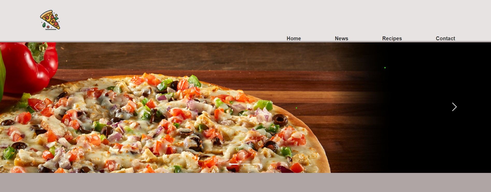

:pizza::pizza::pizza::pizza::pizza::pizza::pizza::pizza::pizza::pizza::pizza::pizza::pizza::pizza::pizza::pizza::pizza::pizza::pizza::pizza::pizza::pizza::pizza::pizza::pizza::pizza::pizza::pizza::pizza::pizza::pizza::pizza::pizza::pizza::pizza::pizza::pizza::pizza::pizza::pizza::pizza::pizza::pizza::pizza::pizza::pizza::pizza::pizza::pizza::pizza::pizza::pizza::pizza::pizza::pizza::pizza:
<h1 align="center">Hi there, it is <a href="https://piizo.pythonanywhere.com/" target="_blank">WaWka</a>'s Pizzarestoran 
    
</h1>
:pizza::pizza::pizza::pizza::pizza::pizza::pizza::pizza::pizza::pizza::pizza::pizza::pizza::pizza::pizza::pizza::pizza::pizza::pizza::pizza::pizza::pizza::pizza::pizza::pizza::pizza::pizza::pizza::pizza::pizza::pizza::pizza::pizza::pizza::pizza::pizza::pizza::pizza::pizza::pizza::pizza::pizza::pizza::pizza::pizza::pizza::pizza::pizza::pizza::pizza::pizza::pizza::pizza::pizza::pizza::pizza::pizza:

</h3>

</h3>
<h3 align="center">Let's setup the project</h3>

Create virtualenv

    python3 -m venv venv

Enter the venv

    source venv/bin/activate

Install required modules with requirements.txt

    pip install -r requirements.txt

Run the prejoct

    python3 manage.py runserver

</h3> Thank you
